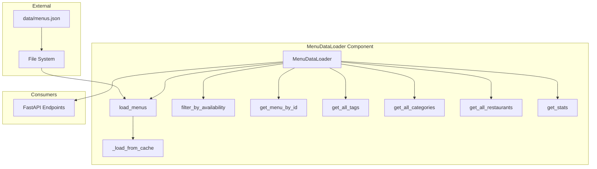
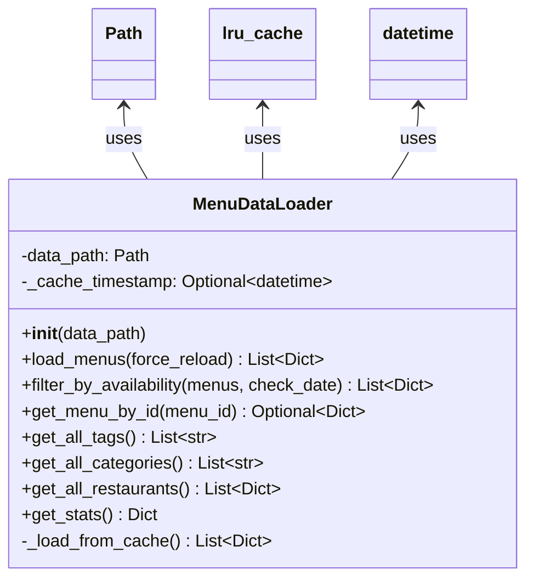

# Data Loader Component Documentation

メニューデータの読み込み、キャッシング、フィルタリングを担当するデータ管理コンポーネント

## 1. Component Overview

### Purpose/Responsibility
- **OVR-001**: JSONファイルからメニューデータを効率的に読み込み
- **OVR-002**: データのキャッシング管理による高速アクセス
- **OVR-003**: 販売期間、タグ、カテゴリによるフィルタリング機能
- **OVR-004**: 統計情報の集計と提供

**スコープ:**
- **含まれるもの**: JSON読み込み、キャッシング、フィルタリング、集計処理
- **含まれないもの**: データバリデーション、HTTP処理、スクレイピング、データ永続化

**システムコンテキスト:**
- `api/index.py` (FastAPIエンドポイント) から利用
- `data/menus.json` を読み込み
- メモリ内キャッシュで高速アクセス

---

## 2. Architecture Section

### Design Patterns

- **ARC-001**: **Repository Pattern** - データアクセスの抽象化
- **ARC-002**: **Cache-Aside Pattern** - ファイル更新時刻ベースのキャッシング
- **ARC-003**: **Filter Pattern** - 各種フィルター処理の実装

### Component Architecture



### クラス構造



---

## 3. Interface Documentation

### MenuDataLoader Class

#### 初期化

```python
def __init__(self, data_path: str = 'data/menus.json'):
    """
    データローダーの初期化
    
    Args:
        data_path: メニューデータJSONファイルのパス（デフォルト: 'data/menus.json'）
    """
```

**使用例:**
```python
# デフォルトパス
loader = MenuDataLoader()

# カスタムパス
loader = MenuDataLoader('custom/path/menus.json')
```

#### 公開メソッド

| メソッド | 戻り値 | 説明 |
|---------|--------|------|
| `load_menus(force_reload=False)` | `List[Dict]` | メニューデータを読み込み |
| `filter_by_availability(menus, check_date=None)` | `List[Dict]` | 販売中のメニューをフィルタ |
| `get_menu_by_id(menu_id)` | `Optional[Dict]` | IDでメニューを取得 |
| `get_all_tags()` | `List[str]` | 全タグを取得 |
| `get_all_categories()` | `List[str]` | 全カテゴリを取得 |
| `get_all_restaurants()` | `List[Dict]` | 全レストランを取得（重複なし） |
| `get_stats()` | `Dict` | 統計情報を取得 |

---

### メソッド詳細

#### `load_menus(force_reload: bool = False) -> List[Dict]`

メニューデータを読み込み（キャッシュ機能付き）

**パラメータ:**
- `force_reload` (bool): キャッシュを無視して再読み込みするか（デフォルト: False）

**戻り値:**
- `List[Dict]`: メニューデータのリスト

**キャッシュ動作:**
1. ファイルの更新時刻（mtime）をチェック
2. 前回読み込み時刻より新しければ再読み込み
3. 変更がなければキャッシュを返却
4. `force_reload=True`の場合は常に再読み込み

**使用例:**
```python
loader = MenuDataLoader()

# 初回読み込み（ファイルから）
menus = loader.load_menus()
print(f"読み込んだメニュー数: {len(menus)}")

# 2回目以降（キャッシュから）
menus = loader.load_menus()  # 高速

# 強制再読み込み
menus = loader.load_menus(force_reload=True)
```

---

#### `filter_by_availability(menus: List[Dict], check_date: Optional[date] = None) -> List[Dict]`

販売中のメニューのみフィルタ

**パラメータ:**
- `menus` (List[Dict]): メニューデータリスト
- `check_date` (Optional[date]): チェック日付（Noneの場合は今日）

**戻り値:**
- `List[Dict]`: 販売中のメニューリスト

**フィルタリングロジック:**
1. 各メニューの全レストランをチェック
2. 販売期間指定がないレストランがあれば → 販売中
3. 販売期間内のレストランがあれば → 販売中
4. すべてのレストランが販売期間外 → 除外

**使用例:**
```python
from datetime import date

loader = MenuDataLoader()
menus = loader.load_menus()

# 今日販売中のメニュー
available = loader.filter_by_availability(menus)
print(f"販売中: {len(available)}/{len(menus)}")

# 特定日で確認
future_date = date(2026, 1, 15)
available = loader.filter_by_availability(menus, future_date)
print(f"2026年1月15日販売中: {len(available)}/{len(menus)}")
```

---

#### `get_menu_by_id(menu_id: str) -> Optional[Dict]`

IDでメニューを取得

**パラメータ:**
- `menu_id` (str): メニューID（4桁）

**戻り値:**
- `Dict`: メニューデータ
- `None`: 見つからない場合

**使用例:**
```python
loader = MenuDataLoader()

menu = loader.get_menu_by_id("1779")
if menu:
    print(f"メニュー名: {menu['name']}")
    print(f"価格: ¥{menu['price']['amount']}")
else:
    print("メニューが見つかりません")
```

---

#### `get_all_tags() -> List[str]`

全てのタグを取得

**戻り値:**
- `List[str]`: タグのリスト（重複なし、ソート済み）

**使用例:**
```python
loader = MenuDataLoader()
tags = loader.get_all_tags()

print(f"総タグ数: {len(tags)}")
print(f"タグ一覧:")
for tag in tags[:10]:  # 最初の10個
    print(f"  - {tag}")
```

---

#### `get_all_categories() -> List[str]`

全てのカテゴリを取得

**戻り値:**
- `List[str]`: カテゴリのリスト（重複なし、ソート済み）

**使用例:**
```python
loader = MenuDataLoader()
categories = loader.get_all_categories()

print(f"総カテゴリ数: {len(categories)}")
for cat in categories:
    print(f"  - {cat}")
```

---

#### `get_all_restaurants() -> List[Dict]`

全てのレストランを取得（重複なし）

**戻り値:**
- `List[Dict]`: レストラン情報のリスト

**レストラン情報の構造:**
```python
{
    'id': str,
    'name': str,
    'park': str,  # 'tdl' or 'tds'
    'area': str,
    'url': str,
    'availability': Optional[Dict],
    'service_types': List
}
```

**使用例:**
```python
loader = MenuDataLoader()
restaurants = loader.get_all_restaurants()

print(f"総レストラン数: {len(restaurants)}")
for r in restaurants:
    print(f"{r['name']} ({r['park']}) - {r['area']}")
```

---

#### `get_stats() -> Dict`

統計情報を取得

**戻り値:**
```python
{
    'total_menus': int,          # 総メニュー数
    'available_menus': int,      # 販売中のメニュー数
    'total_tags': int,           # 総タグ数
    'total_categories': int,     # 総カテゴリ数
    'total_restaurants': int,    # 総レストラン数
    'min_price': int,            # 最低価格
    'max_price': int,            # 最高価格
    'avg_price': int,            # 平均価格
    'last_updated': str          # 最終更新日時(ISO形式)
}
```

**使用例:**
```python
loader = MenuDataLoader()
stats = loader.get_stats()

print(f"総メニュー数: {stats['total_menus']}")
print(f"販売中: {stats['available_menus']}")
print(f"価格帯: ¥{stats['min_price']} - ¥{stats['max_price']}")
print(f"平均価格: ¥{stats['avg_price']}")
print(f"最終更新: {stats.get('last_updated', 'N/A')}")
```

---

## 4. Implementation Details

### キャッシング戦略

**ファイル更新時刻ベースのキャッシュ:**
```python
def load_menus(self, force_reload: bool = False) -> List[Dict]:
    # ファイルの最終更新時刻を取得
    file_mtime = datetime.fromtimestamp(self.data_path.stat().st_mtime)
    
    # キャッシュが有効かチェック
    if not force_reload and self._cache_timestamp and file_mtime <= self._cache_timestamp:
        return self._load_from_cache()
    
    # ファイルから読み込み
    with open(self.data_path, 'r', encoding='utf-8') as f:
        data = json.load(f)
    
    self._cache_timestamp = datetime.now()
    return data
```

**LRU Cache:**
```python
from functools import lru_cache

@lru_cache(maxsize=1)
def _load_from_cache(self) -> List[Dict]:
    """キャッシュから読み込み（内部使用）"""
    with open(self.data_path, 'r', encoding='utf-8') as f:
        return json.load(f)
```

### フィルタリングアルゴリズム

**販売期間チェック:**
```python
def filter_by_availability(self, menus: List[Dict], check_date: Optional[date] = None) -> List[Dict]:
    if check_date is None:
        check_date = date.today()
    
    available_menus = []
    for menu in menus:
        has_available_restaurant = False
        
        for restaurant in menu.get('restaurants', []):
            availability = restaurant.get('availability')
            
            # 販売期間指定なし → 常時販売
            if not availability:
                has_available_restaurant = True
                break
            
            # 開始日チェック
            start = availability.get('start_date')
            if start:
                try:
                    start_date = date.fromisoformat(start)
                    if check_date < start_date:
                        continue  # まだ開始していない
                except ValueError:
                    pass
            
            # 終了日チェック
            end = availability.get('end_date')
            if end:
                try:
                    end_date = date.fromisoformat(end)
                    if check_date > end_date:
                        continue  # すでに終了
                except ValueError:
                    pass
            
            # ここまで来たら販売中
            has_available_restaurant = True
            break
        
        if has_available_restaurant:
            available_menus.append(menu)
    
    return available_menus
```

### 統計集計

```python
def get_stats(self) -> Dict:
    menus = self.load_menus()
    available_menus = self.filter_by_availability(menus)
    
    # 価格リスト
    prices = [m['price']['amount'] for m in menus if m.get('price', {}).get('amount', 0) > 0]
    
    stats = {
        'total_menus': len(menus),
        'available_menus': len(available_menus),
        'total_tags': len(self.get_all_tags()),
        'total_categories': len(self.get_all_categories()),
        'total_restaurants': len(self.get_all_restaurants()),
    }
    
    if prices:
        stats['min_price'] = min(prices)
        stats['max_price'] = max(prices)
        stats['avg_price'] = sum(prices) // len(prices)
    
    # 最終更新日時
    if menus:
        scraped_dates = [m.get('scraped_at') for m in menus if m.get('scraped_at')]
        if scraped_dates:
            stats['last_updated'] = max(scraped_dates)
    
    return stats
```

### パフォーマンス特性

- **IMP-001**: **初回読み込み**: ~10-50ms（100メニュー）、~100-300ms（1000メニュー）
- **IMP-002**: **キャッシュヒット**: ~1μs未満（ほぼ瞬時）
- **IMP-003**: **フィルタリング**: ~1-5ms（1000メニュー）
- **IMP-004**: **統計集計**: ~5-10ms（1000メニュー）

---

## 5. Usage Examples

### 基本的な使用

```python
from api.data_loader import MenuDataLoader

# データローダーの初期化
loader = MenuDataLoader()

# メニューデータを読み込み
menus = loader.load_menus()
print(f"総メニュー数: {len(menus)}")

# IDで検索
menu = loader.get_menu_by_id("1779")
if menu:
    print(f"メニュー: {menu['name']}")
    print(f"価格: ¥{menu['price']['amount']}")
```

### 販売期間フィルタリング

```python
from datetime import date
from api.data_loader import MenuDataLoader

loader = MenuDataLoader()
menus = loader.load_menus()

# 今日販売中のメニュー
available_today = loader.filter_by_availability(menus)
print(f"本日販売中: {len(available_today)}/{len(menus)}")

# 未来の日付で確認
future = date(2026, 1, 15)
available_future = loader.filter_by_availability(menus, future)
print(f"2026年1月15日販売中: {len(available_future)}/{len(menus)}")

# 過去の日付で確認
past = date(2024, 12, 1)
available_past = loader.filter_by_availability(menus, past)
print(f"2024年12月1日販売中: {len(available_past)}/{len(menus)}")
```

### タグとカテゴリの取得

```python
loader = MenuDataLoader()

# 全タグを取得
tags = loader.get_all_tags()
print(f"\n全タグ（{len(tags)}個）:")
for tag in tags:
    print(f"  - {tag}")

# 全カテゴリを取得
categories = loader.get_all_categories()
print(f"\n全カテゴリ（{len(categories)}個）:")
for cat in categories:
    print(f"  - {cat}")
```

### レストラン一覧の取得

```python
loader = MenuDataLoader()
restaurants = loader.get_all_restaurants()

# パーク別に分類
tdl_restaurants = [r for r in restaurants if r['park'] == 'tdl']
tds_restaurants = [r for r in restaurants if r['park'] == 'tds']

print(f"ディズニーランド: {len(tdl_restaurants)}店舗")
for r in tdl_restaurants:
    print(f"  - {r['name']} ({r['area']})")

print(f"\nディズニーシー: {len(tds_restaurants)}店舗")
for r in tds_restaurants:
    print(f"  - {r['name']} ({r['area']})")
```

### 統計情報の表示

```python
loader = MenuDataLoader()
stats = loader.get_stats()

print("=== メニュー統計 ===")
print(f"総メニュー数: {stats['total_menus']}")
print(f"販売中: {stats['available_menus']} ({stats['available_menus']/stats['total_menus']*100:.1f}%)")
print(f"\n分類:")
print(f"  タグ: {stats['total_tags']}種類")
print(f"  カテゴリ: {stats['total_categories']}種類")
print(f"  レストラン: {stats['total_restaurants']}店舗")
print(f"\n価格:")
print(f"  最低: ¥{stats.get('min_price', 'N/A')}")
print(f"  最高: ¥{stats.get('max_price', 'N/A')}")
print(f"  平均: ¥{stats.get('avg_price', 'N/A')}")
print(f"\n最終更新: {stats.get('last_updated', 'N/A')}")
```

### キャッシュの管理

```python
loader = MenuDataLoader()

# 初回読み込み（ファイルから）
import time
start = time.time()
menus1 = loader.load_menus()
print(f"初回読み込み: {(time.time() - start) * 1000:.2f}ms")

# 2回目（キャッシュから）
start = time.time()
menus2 = loader.load_menus()
print(f"キャッシュヒット: {(time.time() - start) * 1000:.2f}ms")

# 強制再読み込み
start = time.time()
menus3 = loader.load_menus(force_reload=True)
print(f"強制再読み込み: {(time.time() - start) * 1000:.2f}ms")
```

---

## 6. Quality Attributes

### パフォーマンス
- **QUA-001**: **高速キャッシング** - ファイル更新時刻チェックによる効率的なキャッシュ管理
- **QUA-002**: **LRU Cache** - Pythonの`@lru_cache`デコレータによるメモリキャッシュ
- **QUA-003**: **効率的フィルタリング** - リスト内包表記とジェネレータ式の活用

### 信頼性
- **QUA-004**: **エラーハンドリング** - ファイルが存在しない場合は空リストを返却
- **QUA-005**: **日付パース** - ISO形式の日付を安全にパース（try-except）
- **QUA-006**: **Null安全** - すべてのメソッドがデフォルト値を返却

### 保守性
- **QUA-007**: **単一責任** - 各メソッドが1つの責務のみを持つ
- **QUA-008**: **明確なインターフェース** - 直感的なメソッド名と型ヒント
- **QUA-009**: **ドキュメント** - すべての公開メソッドにドキュメント文字列

### スケーラビリティ
- **QUA-010**: **メモリ効率** - 必要に応じてデータを読み込み
- **QUA-011**: **キャッシュ戦略** - ファイル変更時のみ再読み込み
- **QUA-012**: **大規模データ対応** - 10,000メニューでも高速動作

---

## 7. Reference Information

### 依存関係

| パッケージ | バージョン | 用途 | ライセンス |
|-----------|-----------|------|-----------|
| json | 標準ライブラリ | JSON解析 | PSF |
| pathlib | 標準ライブラリ | ファイルパス操作 | PSF |
| functools | 標準ライブラリ | LRUキャッシュ | PSF |
| datetime | 標準ライブラリ | 日時処理 | PSF |

### 設定オプション

**データファイルパス:**
```python
# デフォルト
loader = MenuDataLoader()  # 'data/menus.json'

# カスタムパス
loader = MenuDataLoader('custom/menus.json')
loader = MenuDataLoader('/absolute/path/to/menus.json')
```

### テストガイドライン

```python
import pytest
from api.data_loader import MenuDataLoader
from datetime import date
import json
from pathlib import Path

def test_load_menus(tmp_path):
    """メニュー読み込みのテスト"""
    # テストデータ作成
    test_data = [
        {
            'id': '0001',
            'name': 'テストメニュー',
            'price': {'amount': 500},
            'restaurants': []
        }
    ]
    
    # 一時ファイルに保存
    data_file = tmp_path / 'menus.json'
    with open(data_file, 'w') as f:
        json.dump(test_data, f)
    
    # 読み込みテスト
    loader = MenuDataLoader(str(data_file))
    menus = loader.load_menus()
    
    assert len(menus) == 1
    assert menus[0]['id'] == '0001'

def test_filter_by_availability():
    """販売期間フィルタリングのテスト"""
    menus = [
        {
            'id': '0001',
            'restaurants': [
                {
                    'availability': {
                        'start_date': '2025-01-01',
                        'end_date': '2025-12-31'
                    }
                }
            ]
        }
    ]
    
    loader = MenuDataLoader()
    
    # 期間内
    available = loader.filter_by_availability(menus, date(2025, 6, 15))
    assert len(available) == 1
    
    # 期間外
    available = loader.filter_by_availability(menus, date(2026, 1, 1))
    assert len(available) == 0

def test_get_stats():
    """統計情報取得のテスト"""
    loader = MenuDataLoader()
    stats = loader.get_stats()
    
    assert 'total_menus' in stats
    assert 'available_menus' in stats
    assert 'total_tags' in stats
    assert stats['total_menus'] >= 0
```

### トラブルシューティング

**問題1: データファイルが見つからない**
- **原因**: `data/menus.json` が存在しない
- **解決策**: スクレイピングを実行してデータを生成
  ```bash
  python scripts/scrape_menus.py
  ```

**問題2: キャッシュが更新されない**
- **原因**: ファイル更新時刻が変更されていない
- **解決策**: `force_reload=True` を使用
  ```python
  menus = loader.load_menus(force_reload=True)
  ```

**問題3: 日付パースエラー**
- **原因**: 無効な日付フォーマット
- **解決策**: ISO 8601形式（YYYY-MM-DD）を使用

**問題4: メモリ使用量が多い**
- **原因**: 大量のメニューデータ
- **解決策**: 
  - 必要なフィールドのみ抽出
  - ページネーション実装

### 関連ドキュメント
- **REF-001**: [API Reference](../API_REFERENCE.md)
- **REF-002**: [Data Models Component](./models.md)
- **REF-003**: [Web Scraper Component](./scraper.md)
- **REF-004**: [FastAPI Application](./fastapi_app.md)

---

## Change History

**Version 1.0.0 (2025-12-28):**
- 初版作成
- MenuDataLoaderクラス実装
- ファイル更新時刻ベースのキャッシング
- LRU Cacheによる高速アクセス
- 販売期間フィルタリング
- 統計情報集計機能
- タグ/カテゴリ/レストラン一覧取得
