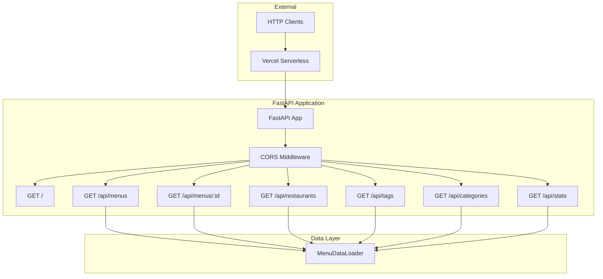

# FastAPI Application Component Documentation

RESTful APIエンドポイントを提供するFastAPIアプリケーションコンポーネント

## 1. Component Overview

### Purpose/Responsibility
- **OVR-001**: RESTful APIエンドポイントの提供
- **OVR-002**: リクエストバリデーションとレスポンスシリアライゼーション
- **OVR-003**: CORS設定とミドルウェア管理
- **OVR-004**: Vercelサーバーレス環境へのデプロイ対応

**スコープ:**
- **含まれるもの**: APIエンドポイント、リクエスト処理、レスポンス生成、エラーハンドリング
- **含まれないもの**: データ永続化、スクレイピング、ビジネスロジック

**システムコンテキスト:**
- Reactフロントエンド（予定）からのHTTPリクエストを処理
- `MenuDataLoader` を使用してデータ取得
- Vercelサーバーレス関数として動作

---

## 2. Architecture Section

### Design Patterns

- **ARC-001**: **Layered Architecture** - プレゼンテーション層とデータアクセス層の分離
- **ARC-002**: **Dependency Injection** - MenuDataLoaderの注入
- **ARC-003**: **RESTful API Design** - リソース指向のエンドポイント設計

### Component Architecture



### エンドポイント構造

```mermaid
classDiagram
    class FastAPIApp {
        +GET /
        +GET /api/menus
        +GET /api/menus/{id}
        +GET /api/restaurants
        +GET /api/tags
        +GET /api/categories
        +GET /api/stats
    }
    
    class MenuListResponse {
        +success: bool
        +data: List[dict]
        +meta: dict
    }
    
    class MenuResponse {
        +success: bool
        +data: dict
    }
    
    class ListResponse {
        +success: bool
        +data: List
    }
    
    class StatsResponse {
        +success: bool
        +data: dict
    }
    
    FastAPIApp --> MenuListResponse : returns
    FastAPIApp --> MenuResponse : returns
    FastAPIApp --> ListResponse : returns
    FastAPIApp --> StatsResponse : returns
    FastAPIApp --> MenuDataLoader : uses
```

---

## 3. Interface Documentation

### API Endpoints

#### `GET /`

APIルート情報を取得

**レスポンス:**
```json
{
  "message": "Disney Menu API",
  "version": "1.0.0",
  "endpoints": {
    "menus": "/api/menus",
    "menu_by_id": "/api/menus/{id}",
    "restaurants": "/api/restaurants",
    "tags": "/api/tags",
    "categories": "/api/categories",
    "stats": "/api/stats"
  }
}
```

**使用例:**
```bash
curl http://localhost:8000/
```

---

#### `GET /api/menus`

メニュー一覧を取得（フィルタリング・ページネーション対応）

**クエリパラメータ:**

| パラメータ | 型 | デフォルト | 説明 | バリデーション |
|-----------|-----|-----------|------|--------------|
| `q` | string | - | 検索クエリ（名前、説明） | - |
| `tags` | string | - | タグフィルタ（カンマ区切り） | - |
| `categories` | string | - | カテゴリフィルタ（カンマ区切り） | - |
| `min_price` | integer | - | 最小価格 | ≥0 |
| `max_price` | integer | - | 最大価格 | ≥0 |
| `park` | string | - | パークフィルタ（`tdl`/`tds`） | ParkType enum |
| `area` | string | - | エリアフィルタ | - |
| `character` | string | - | キャラクターフィルタ | - |
| `only_available` | boolean | true | 販売中のみ | - |
| `page` | integer | 1 | ページ番号 | ≥1 |
| `limit` | integer | 50 | 1ページあたりの件数 | 1-100 |

**レスポンス:**
```json
{
  "success": true,
  "data": [
    {
      "id": "1779",
      "name": "リトルグリーンまん",
      "price": {
        "amount": 400,
        "unit": "1カップ"
      },
      "restaurants": [...],
      "tags": [...],
      "categories": [...]
    }
  ],
  "meta": {
    "total": 150,
    "page": 1,
    "limit": 50,
    "pages": 3
  }
}
```

**使用例:**
```bash
# 基本的な取得
curl "http://localhost:8000/api/menus"

# 検索
curl "http://localhost:8000/api/menus?q=カレー"

# パークとエリアでフィルタ
curl "http://localhost:8000/api/menus?park=tdl&area=トゥモローランド"

# 価格範囲でフィルタ
curl "http://localhost:8000/api/menus?min_price=500&max_price=1000"

# タグでフィルタ
curl "http://localhost:8000/api/menus?tags=キャラクターモチーフのメニュー"

# 複数条件の組み合わせ
curl "http://localhost:8000/api/menus?park=tdl&min_price=300&max_price=600&only_available=true&page=1&limit=20"
```

---

#### `GET /api/menus/{menu_id}`

特定のメニューを取得

**パスパラメータ:**
- `menu_id` (string): メニューID（4桁）

**レスポンス (200 OK):**
```json
{
  "success": true,
  "data": {
    "id": "1779",
    "name": "リトルグリーンまん",
    "description": "東京ディズニーシー、東京ディズニーランドのおすすめメニュー...",
    "price": {
      "amount": 400,
      "unit": "1カップ",
      "tax_included": true
    },
    "image_urls": ["https://..."],
    "thumbnail_url": "https://...",
    "restaurants": [...],
    "categories": ["デザート／スウィーツ", "スナック"],
    "tags": ["キャラクターモチーフのメニュー", "～500円"],
    "characters": ["トイ・ストーリー", "ピクサー"],
    "source_url": "https://www.tokyodisneyresort.jp/food/1779/",
    "scraped_at": "2025-12-28T12:00:00",
    "is_seasonal": false,
    "is_available": true
  }
}
```

**エラーレスポンス (404 Not Found):**
```json
{
  "detail": "Menu not found"
}
```

**使用例:**
```bash
curl "http://localhost:8000/api/menus/1779"
```

---

#### `GET /api/restaurants`

レストラン一覧を取得

**クエリパラメータ:**

| パラメータ | 型 | デフォルト | 説明 |
|-----------|-----|-----------|------|
| `park` | string | - | パークフィルタ（`tdl`/`tds`） |

**レスポンス:**
```json
{
  "success": true,
  "data": [
    {
      "id": "335",
      "name": "プラザパビリオン・レストラン",
      "park": "tdl",
      "area": "ウエスタンランド",
      "url": "https://www.tokyodisneyresort.jp/tdl/restaurant/detail/335/",
      "service_types": [],
      "availability": null
    }
  ]
}
```

**使用例:**
```bash
# 全レストラン
curl "http://localhost:8000/api/restaurants"

# ディズニーランドのみ
curl "http://localhost:8000/api/restaurants?park=tdl"

# ディズニーシーのみ
curl "http://localhost:8000/api/restaurants?park=tds"
```

---

#### `GET /api/tags`

タグ一覧を取得

**レスポンス:**
```json
{
  "success": true,
  "data": [
    "～500円",
    "カウンターサービス",
    "キャラクターモチーフのメニュー",
    "スナック",
    "バフェテリアサービス"
  ]
}
```

**使用例:**
```bash
curl "http://localhost:8000/api/tags"
```

---

#### `GET /api/categories`

カテゴリ一覧を取得

**レスポンス:**
```json
{
  "success": true,
  "data": [
    "おすすめメニュー",
    "スウィーツ",
    "スナック",
    "デザート／スウィーツ"
  ]
}
```

**使用例:**
```bash
curl "http://localhost:8000/api/categories"
```

---

#### `GET /api/stats`

統計情報を取得

**レスポンス:**
```json
{
  "success": true,
  "data": {
    "total_menus": 150,
    "available_menus": 145,
    "total_tags": 25,
    "total_categories": 8,
    "total_restaurants": 50,
    "min_price": 300,
    "max_price": 2500,
    "avg_price": 850,
    "last_updated": "2025-12-28T12:00:00"
  }
}
```

**使用例:**
```bash
curl "http://localhost:8000/api/stats"
```

---

## 4. Implementation Details

### アプリケーション初期化

```python
app = FastAPI(
    title="Disney Menu API",
    description="API for browsing Tokyo Disney Resort food menus",
    version="1.0.0"
)

# CORS設定
app.add_middleware(
    CORSMiddleware,
    allow_origins=["*"],  # 本番環境では適切に設定
    allow_methods=["GET"],
    allow_headers=["*"],
)

# データローダー
loader = MenuDataLoader()
```

### フィルタリングロジック

```python
async def get_menus(q, tags, categories, min_price, max_price, park, area, character, only_available, page, limit):
    # 1. データ読み込み
    menus = loader.load_menus()
    
    # 2. 販売中フィルタ
    if only_available:
        menus = loader.filter_by_availability(menus)
    
    # 3. 検索フィルタ
    if q:
        q_lower = q.lower()
        menus = [m for m in menus if q_lower in m['name'].lower() or q_lower in m.get('description', '').lower()]
    
    # 4. タグフィルタ
    if tags:
        tag_list = [t.strip() for t in tags.split(',')]
        menus = [m for m in menus if any(tag in m.get('tags', []) for tag in tag_list)]
    
    # 5. カテゴリフィルタ
    if categories:
        category_list = [c.strip() for c in categories.split(',')]
        menus = [m for m in menus if any(cat in m.get('categories', []) for cat in category_list)]
    
    # 6. 価格フィルタ
    if min_price is not None:
        menus = [m for m in menus if m['price']['amount'] >= min_price]
    if max_price is not None:
        menus = [m for m in menus if m['price']['amount'] <= max_price]
    
    # 7. パークフィルタ
    if park:
        menus = [m for m in menus if any(r['park'] == park for r in m.get('restaurants', []))]
    
    # 8. エリアフィルタ
    if area:
        menus = [m for m in menus if any(area.lower() in r['area'].lower() for r in m.get('restaurants', []))]
    
    # 9. キャラクターフィルタ
    if character:
        menus = [m for m in menus if any(character.lower() in c.lower() for c in m.get('characters', []))]
    
    # 10. ページネーション
    total = len(menus)
    start = (page - 1) * limit
    end = start + limit
    paginated_menus = menus[start:end]
    
    return MenuListResponse(
        data=paginated_menus,
        meta={
            "total": total,
            "page": page,
            "limit": limit,
            "pages": (total + limit - 1) // limit
        }
    )
```

### エラーハンドリング

```python
@app.get("/api/menus/{menu_id}", response_model=MenuResponse)
async def get_menu(menu_id: str):
    menu = loader.get_menu_by_id(menu_id)
    
    if not menu:
        raise HTTPException(status_code=404, detail="Menu not found")
    
    return MenuResponse(data=menu)
```

### Vercelハンドラー

```python
# Vercel用のハンドラー
handler = app
```

### パフォーマンス特性

- **IMP-001**: **レスポンスタイム**: ~10-50ms（キャッシュヒット時）
- **IMP-002**: **レスポンスタイム**: ~50-200ms（フィルタリング込み）
- **IMP-003**: **コールドスタート**: ~500-1000ms（Vercel初回起動）
- **IMP-004**: **スループット**: ~100-200 req/sec（単一インスタンス）

---

## 5. Usage Examples

### Pythonクライアント

```python
import requests

BASE_URL = "http://localhost:8000"

# メニュー一覧を取得
response = requests.get(f"{BASE_URL}/api/menus")
data = response.json()

print(f"総メニュー数: {data['meta']['total']}")
for menu in data['data']:
    print(f"- {menu['name']}: ¥{menu['price']['amount']}")

# 特定メニューを取得
response = requests.get(f"{BASE_URL}/api/menus/1779")
menu = response.json()['data']
print(f"\nメニュー詳細:")
print(f"名前: {menu['name']}")
print(f"価格: ¥{menu['price']['amount']}")
print(f"レストラン: {', '.join(r['name'] for r in menu['restaurants'])}")

# フィルタリング
params = {
    'park': 'tdl',
    'min_price': 300,
    'max_price': 600,
    'page': 1,
    'limit': 10
}
response = requests.get(f"{BASE_URL}/api/menus", params=params)
data = response.json()
print(f"\nフィルタ結果: {data['meta']['total']}件")
```

### JavaScriptクライアント

```javascript
const BASE_URL = 'http://localhost:8000';

// メニュー一覧を取得
async function getMenus() {
  const response = await fetch(`${BASE_URL}/api/menus`);
  const data = await response.json();
  
  console.log(`総メニュー数: ${data.meta.total}`);
  data.data.forEach(menu => {
    console.log(`- ${menu.name}: ¥${menu.price.amount}`);
  });
}

// 検索
async function searchMenus(query) {
  const response = await fetch(`${BASE_URL}/api/menus?q=${encodeURIComponent(query)}`);
  const data = await response.json();
  return data.data;
}

// フィルタリング
async function getMenusByPark(park) {
  const response = await fetch(`${BASE_URL}/api/menus?park=${park}&only_available=true`);
  const data = await response.json();
  return data.data;
}

// 統計情報
async function getStats() {
  const response = await fetch(`${BASE_URL}/api/stats`);
  const data = await response.json();
  console.log('統計情報:', data.data);
}
```

### curlコマンド

```bash
# 基本的な取得
curl "http://localhost:8000/api/menus"

# 検索
curl "http://localhost:8000/api/menus?q=カレー"

# 複数フィルタ
curl "http://localhost:8000/api/menus?park=tdl&min_price=500&max_price=1000&page=1&limit=20"

# レストラン一覧
curl "http://localhost:8000/api/restaurants?park=tds"

# タグ一覧
curl "http://localhost:8000/api/tags"

# 統計情報
curl "http://localhost:8000/api/stats"

# 特定メニュー
curl "http://localhost:8000/api/menus/1779"
```

---

## 6. Quality Attributes

### セキュリティ
- **QUA-001**: **CORS設定** - クロスオリジンリクエストの制御
- **QUA-002**: **入力バリデーション** - Pydanticによる自動バリデーション
- **QUA-003**: **読み取り専用API** - GETメソッドのみ許可

### パフォーマンス
- **QUA-004**: **高速レスポンス** - データローダーのキャッシング活用
- **QUA-005**: **効率的フィルタリング** - リスト内包表記による高速処理
- **QUA-006**: **ページネーション** - 大量データの効率的な配信

### 信頼性
- **QUA-007**: **エラーハンドリング** - 404エラーの適切な処理
- **QUA-008**: **型安全性** - Pydanticモデルによる型チェック
- **QUA-009**: **ステートレス** - サーバーレス環境に最適化

### 可用性
- **QUA-010**: **自動スケーリング** - Vercelの自動スケーリング
- **QUA-011**: **グローバル配信** - Vercel Edgeネットワーク
- **QUA-012**: **ヘルスチェック** - ルートエンドポイントで状態確認

### 保守性
- **QUA-013**: **自動ドキュメント** - FastAPIのSwagger UI/ReDoc
- **QUA-014**: **クリーンな構造** - レイヤー分離とDI
- **QUA-015**: **型ヒント** - 完全な型アノテーション

---

## 7. Reference Information

### 依存関係

| パッケージ | バージョン | 用途 | ライセンス |
|-----------|-----------|------|-----------|
| fastapi | >=0.115.0 | Webフレームワーク | MIT |
| uvicorn | >=0.30.0 | ASGIサーバー | BSD |
| pydantic | >=2.10.0 | データバリデーション | MIT |

### CORS設定

**開発環境:**
```python
allow_origins=["*"]  # すべてのオリジンを許可
```

**本番環境:**
```python
allow_origins=[
    "https://yourdomain.com",
    "https://www.yourdomain.com"
]
```

### 自動ドキュメント

FastAPIは自動的にAPIドキュメントを生成:

- **Swagger UI**: http://localhost:8000/docs
- **ReDoc**: http://localhost:8000/redoc
- **OpenAPI JSON**: http://localhost:8000/openapi.json

### テストガイドライン

```python
import pytest
from fastapi.testclient import TestClient
from api.index import app

client = TestClient(app)

def test_root():
    """ルートエンドポイントのテスト"""
    response = client.get("/")
    assert response.status_code == 200
    assert response.json()["message"] == "Disney Menu API"

def test_get_menus():
    """メニュー一覧取得のテスト"""
    response = client.get("/api/menus")
    assert response.status_code == 200
    assert "data" in response.json()
    assert "meta" in response.json()

def test_get_menu_by_id():
    """特定メニュー取得のテスト"""
    response = client.get("/api/menus/1779")
    if response.status_code == 200:
        data = response.json()["data"]
        assert data["id"] == "1779"
    elif response.status_code == 404:
        assert response.json()["detail"] == "Menu not found"

def test_filter_by_park():
    """パークフィルタのテスト"""
    response = client.get("/api/menus?park=tdl")
    assert response.status_code == 200
    menus = response.json()["data"]
    for menu in menus:
        parks = [r["park"] for r in menu["restaurants"]]
        assert "tdl" in parks

def test_pagination():
    """ページネーションのテスト"""
    response = client.get("/api/menus?page=1&limit=10")
    assert response.status_code == 200
    data = response.json()
    assert len(data["data"]) <= 10
    assert data["meta"]["page"] == 1
    assert data["meta"]["limit"] == 10

def test_get_stats():
    """統計情報取得のテスト"""
    response = client.get("/api/stats")
    assert response.status_code == 200
    stats = response.json()["data"]
    assert "total_menus" in stats
    assert "available_menus" in stats
```

### トラブルシューティング

**問題1: CORS エラー**
- **原因**: フロントエンドのオリジンが許可されていない
- **解決策**: `allow_origins` にオリジンを追加

**問題2: 404 エラー (Vercel)**
- **原因**: `vercel.json` のルーティング設定が不正
- **解決策**: `vercel.json` を確認
  ```json
  {
    "rewrites": [
      { "source": "/(.*)", "destination": "/api/index" }
    ]
  }
  ```

**問題3: データが空**
- **原因**: `data/menus.json` が存在しない
- **解決策**: スクレイピングを実行

**問題4: レスポンスが遅い**
- **原因**: データローダーのキャッシュが無効
- **解決策**: キャッシング戦略を確認

### デプロイメント

**Vercel CLI:**
```bash
# プレビューデプロイ
vercel

# 本番デプロイ
vercel --prod
```

**環境変数:**
```bash
# Vercelダッシュボードで設定
DATA_PATH=data/menus.json
```

### 関連ドキュメント
- **REF-001**: [API Reference](../API_REFERENCE.md)
- **REF-002**: [FastAPI Documentation](https://fastapi.tiangolo.com/)
- **REF-003**: [Vercel Python Runtime](https://vercel.com/docs/runtimes/python)
- **REF-004**: [Data Loader Component](./data_loader.md)
- **REF-005**: [Data Models Component](./models.md)

---

## Change History

**Version 1.0.0 (2025-12-28):**
- 初版作成
- FastAPIアプリケーション実装
- 6つのRESTエンドポイント
- CORS middleware設定
- Vercelサーバーレス対応
- 包括的なフィルタリング機能
- ページネーション実装
- エラーハンドリング
- 自動OpenAPIドキュメント生成
