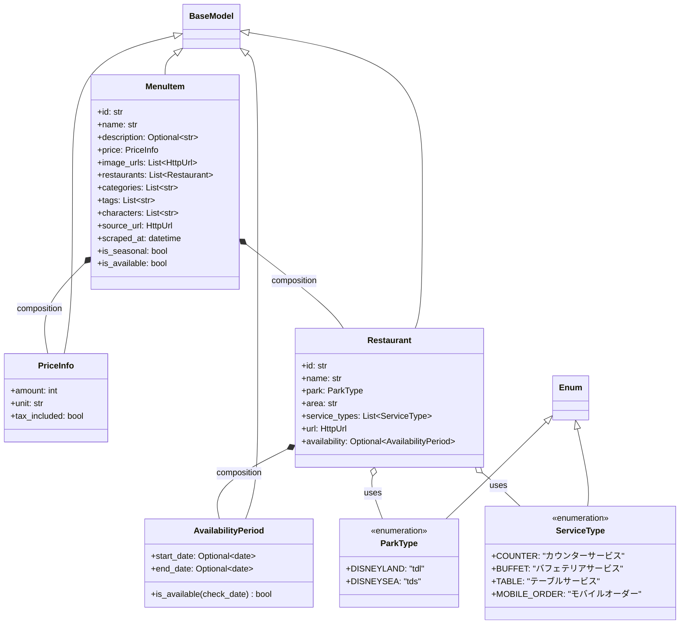

# Data Models Component Documentation

東京ディズニーリゾートのメニューデータを表現するドメインモデル層

## 1. Component Overview

### Purpose/Responsibility
- **OVR-001**: Pydanticを使用した型安全なドメインモデルの定義
- **OVR-002**: 全レイヤー（スクレイパー、API、データ永続化）で使用されるデータ構造の統一
- **OVR-003**: 自動バリデーションとJSONシリアライゼーション機能の提供

**スコープ:**
- **含まれるもの**: メニューアイテム、レストラン情報、価格データ、販売期間、パーク/サービスタイプ列挙型
- **含まれないもの**: ビジネスロジック、データ永続化操作、APIルーティング、スクレイピングロジック

**システムコンテキスト:**
このコンポーネントは以下から利用される:
- `MenuScraper` - スクレイピングデータのバリデーション
- `MenuDataLoader` - JSONデータのデシリアライゼーション
- `FastAPI` エンドポイント - リクエスト/レスポンスのバリデーション
- 外部APIコンシューマー - データ契約の理解

---

## 2. Architecture Section

### Design Patterns

- **ARC-001**: **Value Object Pattern** - 不変のドメイン概念を表すデータ構造
- **ARC-002**: **Data Transfer Object (DTO)** - アプリケーション層間のデータ転送
- **ARC-003**: **Composition Pattern** - シンプルなコンポーネントから複雑なモデルを構築

### Component Structure Diagram



### Dependencies

**External:**
- `pydantic` 2.12.5+ - データバリデーションとシリアライゼーション
- `datetime` - 日付処理
- `typing` - 型アノテーション

**Purpose:**
- **Pydantic**: 自動バリデーション、JSONシリアライゼーション、OpenAPIスキーマ生成
- **datetime**: 日付ベースの販売期間計算
- **Enum**: パークとサービスタイプの型安全な定数

---

## 3. Interface Documentation

### ParkType (Enum)

パーク識別子の型安全な列挙型

| 値 | 説明 | 文字列値 |
|----|------|---------|
| `DISNEYLAND` | 東京ディズニーランド | "tdl" |
| `DISNEYSEA` | 東京ディズニーシー | "tds" |

**使用例:**
```python
from api.models import ParkType

park = ParkType.DISNEYLAND  # 値: "tdl"
```

### ServiceType (Enum)

レストランサービスタイプの列挙型

| 値 | 説明 | 文字列値 |
|----|------|---------|
| `COUNTER` | カウンターサービス | "カウンターサービス" |
| `BUFFET` | バフェテリアサービス | "バフェテリアサービス" |
| `TABLE` | テーブルサービス | "テーブルサービス" |
| `MOBILE_ORDER` | モバイルオーダー | "モバイルオーダー" |

### AvailabilityPeriod (BaseModel)

メニューアイテムの販売期間を管理

| フィールド | 型 | 説明 | バリデーション |
|-----------|-----|------|--------------|
| `start_date` | `Optional[date]` | 販売開始日 | None可（常時販売） |
| `end_date` | `Optional[date]` | 販売終了日 | None可（終了日未定） |

**メソッド:**

```python
def is_available(check_date: Optional[date] = None) -> bool:
    """
    指定日に販売中かチェック
    
    Args:
        check_date: チェックする日付（Noneなら今日）
        
    Returns:
        bool: 販売中ならTrue
        
    アルゴリズム:
        1. check_dateがNoneなら今日の日付を使用
        2. start_date > check_date なら False（未開始）
        3. end_date < check_date なら False（終了済み）
        4. それ以外は True（販売中）
    """
```

**使用例:**
```python
from datetime import date
from api.models import AvailabilityPeriod

period = AvailabilityPeriod(
    start_date=date(2025, 12, 26),
    end_date=None  # 終了日未定
)

# 今日販売中か
if period.is_available():
    print("現在販売中")

# 特定日の確認
if period.is_available(date(2026, 1, 15)):
    print("2026年1月15日は販売中")
```

### PriceInfo (BaseModel)

価格情報の構造化データ

| フィールド | 型 | デフォルト | 説明 | バリデーション |
|-----------|-----|-----------|------|--------------|
| `amount` | `int` | - | 価格（円） | 必須、整数 |
| `unit` | `str` | `""` | 単位（例: "1カップ"） | 任意の文字列 |
| `tax_included` | `bool` | `True` | 税込かどうか | ブール値 |

**使用例:**
```python
from api.models import PriceInfo

price = PriceInfo(amount=400, unit="1カップ", tax_included=True)
print(f"{price.unit} ¥{price.amount}")  # "1カップ ¥400"
```

### Restaurant (BaseModel)

レストラン情報を表すモデル

| フィールド | 型 | 説明 | バリデーション |
|-----------|-----|------|--------------|
| `id` | `str` | レストランID (URLから抽出) | 必須、非空 |
| `name` | `str` | レストラン名 | 必須、非空 |
| `park` | `ParkType` | パーク (tdl/tds) | 有効なParkType |
| `area` | `str` | エリア名（例: トゥモローランド） | 任意の文字列 |
| `service_types` | `List[ServiceType]` | サービスタイプ | ServiceTypeのリスト |
| `url` | `HttpUrl` | レストラン詳細URL | 有効なURL |
| `availability` | `Optional[AvailabilityPeriod]` | このレストランでの販売期間 | AvailabilityPeriod or None |

**使用例:**
```python
from api.models import Restaurant, ParkType

restaurant = Restaurant(
    id="335",
    name="プラザパビリオン・レストラン",
    park=ParkType.DISNEYLAND,
    area="ウエスタンランド",
    service_types=[],
    url="https://www.tokyodisneyresort.jp/tdl/restaurant/detail/335/",
    availability=None
)
```

### MenuItem (BaseModel)

完全なメニューアイテムデータ

**基本情報:**
| フィールド | 型 | 説明 |
|-----------|-----|------|
| `id` | `str` | 4桁のメニューID |
| `name` | `str` | メニュー名（日本語） |
| `description` | `Optional[str]` | メニュー説明 |

**価格:**
| フィールド | 型 | 説明 |
|-----------|-----|------|
| `price` | `PriceInfo` | 価格情報オブジェクト |

**メディア:**
| フィールド | 型 | 説明 |
|-----------|-----|------|
| `image_urls` | `List[HttpUrl]` | メニュー画像URLリスト |
| `thumbnail_url` | `Optional[HttpUrl]` | サムネイル画像URL |

**販売情報:**
| フィールド | 型 | 説明 |
|-----------|-----|------|
| `restaurants` | `List[Restaurant]` | 販売レストランリスト |

**分類:**
| フィールド | 型 | 説明 |
|-----------|-----|------|
| `categories` | `List[str]` | カテゴリ（例: デザート／スウィーツ） |
| `tags` | `List[str]` | タグ（例: キャラクターモチーフ、季節限定） |
| `characters` | `List[str]` | 関連キャラクター（例: トイ・ストーリー） |

**アレルギー・栄養:**
| フィールド | 型 | 説明 |
|-----------|-----|------|
| `allergens` | `List[str]` | アレルゲン情報 |
| `nutritional_info` | `Optional[dict]` | 栄養成分情報 |

**メタデータ:**
| フィールド | 型 | 説明 |
|-----------|-----|------|
| `source_url` | `HttpUrl` | 元ページURL |
| `scraped_at` | `datetime` | スクレイピング日時 |
| `last_updated` | `Optional[datetime]` | 最終更新日時 |

**ステータス:**
| フィールド | 型 | デフォルト | 説明 |
|-----------|-----|-----------|------|
| `is_seasonal` | `bool` | `False` | 季節限定商品か |
| `is_new` | `bool` | `False` | 新商品か |
| `is_available` | `bool` | `True` | 現在販売中か |

**使用例:**
```python
from api.models import MenuItem, PriceInfo, Restaurant, ParkType

menu = MenuItem(
    id="1779",
    name="リトルグリーンまん",
    description="トイ・ストーリーのリトルグリーンメンをモチーフにした中華まん",
    price=PriceInfo(amount=400, unit="1カップ"),
    image_urls=["https://media1.tokyodisneyresort.jp/food_menu/image/1779_1.jpg"],
    restaurants=[
        Restaurant(
            id="335",
            name="プラザパビリオン・レストラン",
            park=ParkType.DISNEYLAND,
            area="ウエスタンランド",
            url="https://www.tokyodisneyresort.jp/tdl/restaurant/detail/335/"
        )
    ],
    categories=["デザート／スウィーツ", "スナック"],
    tags=["キャラクターモチーフのメニュー", "～500円"],
    characters=["トイ・ストーリー", "ピクサー"],
    source_url="https://www.tokyodisneyresort.jp/food/1779/"
)
```

---

## 4. Implementation Details

### 主な実装パターン

**IMP-001: Pydantic BaseModel 継承**
- すべてのモデルは `pydantic.BaseModel` を継承
- 自動的にバリデーション、シリアライゼーション機能を取得

**IMP-002: Enum値のシリアライゼーション**
```python
class Config:
    use_enum_values = True  # Enumを値として出力（名前ではなく）
```

**IMP-003: 自動OpenAPIスキーマ生成**
- FastAPIが自動的にドキュメントとスキーマを生成
- `Field(..., description="...")` がAPIドキュメントに反映

**IMP-004: Example Data**
```python
class Config:
    json_schema_extra = {
        "example": {
            # サンプルデータ
        }
    }
```

### アルゴリズム詳細

**AvailabilityPeriod.is_available():**
```python
def is_available(self, check_date: Optional[date] = None) -> bool:
    if check_date is None:
        check_date = date.today()
    
    # 開始日チェック
    if self.start_date and check_date < self.start_date:
        return False  # まだ開始していない
    
    # 終了日チェック
    if self.end_date and check_date > self.end_date:
        return False  # すでに終了
    
    return True  # 販売中
```

**エッジケース:**
- `start_date = None`: 開始制限なし
- `end_date = None`: 終了制限なし
- 両方 `None`: 常時販売

### パフォーマンス特性

- **IMP-004**: バリデーションオーバーヘッド: ~10-50μs/オブジェクト
- **IMP-005**: メモリ効率: ~1KB/MenuItemオブジェクト
- **IMP-006**: シリアライゼーション速度: Rust実装のpydantic-coreを使用

---

## 5. Usage Examples

### 基本的な使用

```python
from api.models import MenuItem, Restaurant, PriceInfo, ParkType
from datetime import date

# 価格情報の作成
price = PriceInfo(amount=400, unit="1カップ", tax_included=True)

# レストラン情報の作成
restaurant = Restaurant(
    id="335",
    name="プラザパビリオン・レストラン",
    park=ParkType.DISNEYLAND,
    area="ウエスタンランド",
    service_types=[],
    url="https://www.tokyodisneyresort.jp/tdl/restaurant/detail/335/"
)

# メニューアイテムの作成
menu_item = MenuItem(
    id="1779",
    name="リトルグリーンまん",
    description="トイ・ストーリーのリトルグリーンメンをモチーフにした中華まん",
    price=price,
    restaurants=[restaurant],
    source_url="https://www.tokyodisneyresort.jp/food/1779/"
)

print(f"{menu_item.name}: ¥{menu_item.price.amount}")
```

### JSONシリアライゼーション

```python
# 辞書に変換
menu_dict = menu_item.model_dump()

# JSON文字列に変換
menu_json = menu_item.model_dump_json(indent=2)

# JSONから復元
from_json = MenuItem.model_validate_json(menu_json)

# 辞書から復元
from_dict = MenuItem.model_validate(menu_dict)
```

### バリデーション

```python
from pydantic import ValidationError

# 無効なデータでエラーが発生
try:
    invalid = MenuItem(
        id="",  # 空文字列
        name="Test",
        price=PriceInfo(amount=100),
        source_url="not-a-url"  # 無効なURL
    )
except ValidationError as e:
    print(f"バリデーションエラー: {e}")
```

### 販売期間チェック

```python
from datetime import date
from api.models import AvailabilityPeriod

period = AvailabilityPeriod(
    start_date=date(2025, 12, 26),
    end_date=date(2026, 3, 31)
)

# 今日販売中か
if period.is_available():
    print("現在販売中")

# 特定日の確認
if period.is_available(date(2026, 1, 15)):
    print("2026年1月15日は販売中")

# 範囲外
if not period.is_available(date(2026, 4, 1)):
    print("2026年4月1日は販売終了")
```

---

## 6. Quality Attributes

### セキュリティ
- **QUA-001**: **入力バリデーション** - Pydanticによる自動バリデーション
- **QUA-002**: **型安全性** - 強い型付けによる脆弱性防止
- **QUA-003**: **URLバリデーション** - HttpUrlによる安全なURL検証

### パフォーマンス
- **QUA-004**: **高速バリデーション** - Rust実装のpydantic-coreを使用
- **QUA-005**: **最小オーバーヘッド** - オブジェクト生成 ~10-50μs
- **QUA-006**: **効率的シリアライゼーション** - コンパイル済みコードを活用

### 信頼性
- **QUA-007**: **Fail Fast** - モデル境界で無効データを拒否
- **QUA-008**: **明示的デフォルト** - 全オプションフィールドに明確なデフォルト値
- **QUA-009**: **100%型カバレッジ** - IDE支援と静的解析のサポート

### 保守性
- **QUA-010**: **自己文書化** - フィールド説明からAPIドキュメント自動生成
- **QUA-011**: **集中管理スキーマ** - データ構造の単一の真実の源
- **QUA-012**: **バージョン管理** - 例示データの提供

### 拡張性
- **QUA-013**: **簡単な拡張** - 既存コードを壊さずに新フィールド追加可能
- **QUA-014**: **コンポジション** - シンプルなコンポーネントから複雑なモデルを構築
- **QUA-015**: **カスタムバリデーション** - フィールドバリデーターとルートバリデーターの追加可能

---

## 7. Reference Information

### 依存関係

| パッケージ | バージョン | 用途 | ライセンス |
|-----------|-----------|------|-----------|
| pydantic | >=2.10.0 | データバリデーションと設定管理 | MIT |
| pydantic-core | >=2.16.0 | Rust実装バリデーションエンジン | MIT |

### 設定オプション

**Pydantic Config (MenuItem.Config内):**
- `use_enum_values = True` - Enumを値として出力（名前ではなく）
- `json_schema_extra` - OpenAPIドキュメント用のサンプルデータ

### テストガイドライン

```python
import pytest
from api.models import MenuItem, PriceInfo, Restaurant, ParkType
from pydantic import ValidationError

def test_menu_item_validation():
    """無効データでValidationErrorが発生することを確認"""
    with pytest.raises(ValidationError):
        MenuItem(
            id="",  # 無効: 空文字列
            name="Test",
            price=PriceInfo(amount=100),
            source_url="invalid-url"
        )

def test_price_info_defaults():
    """デフォルト値のテスト"""
    price = PriceInfo(amount=500)
    assert price.unit == ""
    assert price.tax_included is True

def test_availability_checking():
    """販売期間ロジックのテスト"""
    from datetime import date
    from api.models import AvailabilityPeriod
    
    period = AvailabilityPeriod(
        start_date=date(2025, 1, 1),
        end_date=date(2025, 12, 31)
    )
    
    assert period.is_available(date(2025, 6, 15)) is True
    assert period.is_available(date(2024, 12, 31)) is False
    assert period.is_available(date(2026, 1, 1)) is False

def test_restaurant_creation():
    """レストラン作成のテスト"""
    restaurant = Restaurant(
        id="335",
        name="プラザパビリオン・レストラン",
        park=ParkType.DISNEYLAND,
        area="ウエスタンランド",
        url="https://www.tokyodisneyresort.jp/tdl/restaurant/detail/335/"
    )
    
    assert restaurant.park == "tdl"  # use_enum_values=True
    assert len(restaurant.service_types) == 0
```

### トラブルシューティング

**問題1: ValidationError: URL validation failed**
- **原因**: URLが `http://` または `https://` で始まっていない
- **解決**: Pydanticの `HttpUrl` 型を使用し、完全なURLを提供

**問題2: ValidationError: Field required**
- **原因**: デフォルト値のないフィールドが提供されていない
- **解決**: すべての必須フィールドを提供するか、`Optional[Type]` を使用

**問題3: Enum value not matching**
- **原因**: Enum値が文字列値と一致しない
- **解決**: `Config` で `use_enum_values = True` を設定

### 関連ドキュメント
- **REF-001**: [API Reference](../API_REFERENCE.md)
- **REF-002**: [Pydantic Documentation](https://docs.pydantic.dev/)
- **REF-003**: [FastAPI Data Validation](https://fastapi.tiangolo.com/tutorial/body/)
- **REF-004**: [Web Scraper Component](./scraper.md)
- **REF-005**: [Data Loader Component](./data_loader.md)

---

## Change History

**Version 1.0.0 (2025-12-28):**
- 初版作成
- 6つのクラス実装（ParkType, ServiceType, AvailabilityPeriod, PriceInfo, Restaurant, MenuItem）
- Pydantic 2.x実装
- 包括的なフィールドバリデーション
- 販売期間ロジック
- OpenAPIスキーマサポート
