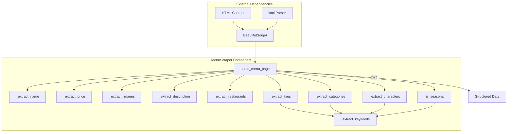
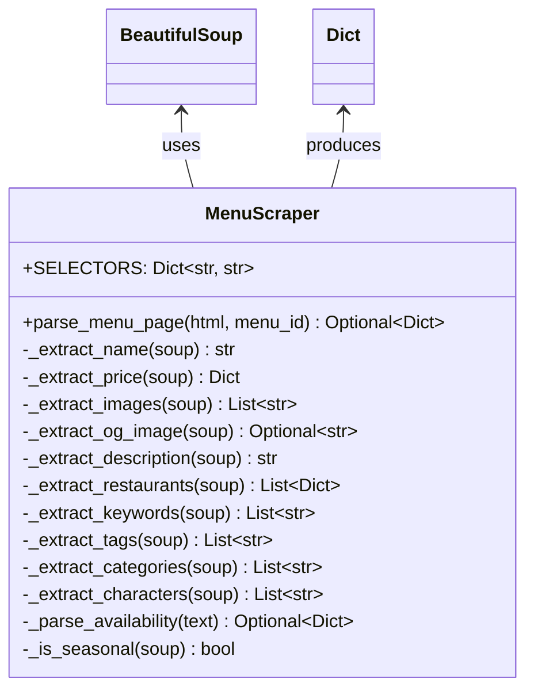

# Web Scraper Component Documentation

東京ディズニーリゾート公式サイトからメニュー情報を抽出するスクレイピングコンポーネント

## 1. Component Overview

### Purpose/Responsibility
- **OVR-001**: HTMLページからメニュー情報を抽出
- **OVR-002**: 構造化データ（辞書形式）への変換
- **OVR-003**: データ完全性の検証とエラーハンドリング

**スコープ:**
- **含まれるもの**: HTML解析、データ抽出、日付パース、キーワード分類
- **含まれないもの**: HTTPリクエスト、レート制限、データ永続化、Pydanticバリデーション

**システムコンテキスト:**
- `scripts/scrape_menus.py` から呼び出される
- 抽出データは `MenuItem` モデルでバリデーション
- `data/menus.json` に保存

---

## 2. Architecture Section

### Design Patterns

- **ARC-001**: **Strategy Pattern** - CSS セレクターによる柔軟な要素抽出
- **ARC-002**: **Template Method Pattern** - `parse_menu_page` が各抽出メソッドを呼び出す
- **ARC-003**: **Null Object Pattern** - データが見つからない場合のデフォルト値返却

### Component Architecture



### クラス構造



---

## 3. Interface Documentation

### MenuScraper Class

#### クラス変数

**`SELECTORS`**: CSSセレクター定義辞書

| キー | セレクター | 説明 | 対象要素 |
|-----|-----------|------|---------|
| `title` | `h1.heading1` | メニュー名 | ページタイトル |
| `price` | `p.price` | 価格テキスト | 価格表示 |
| `images` | `.columnImage img` | 画像要素 | メニュー画像 |
| `og_image` | `meta[property="og:image"]` | OGP画像 | SNS共有用画像 |
| `description` | `meta[name="description"]` | 説明文メタタグ | ページ説明 |
| `keywords` | `meta[name="keywords"]` | キーワードメタタグ | タグ・カテゴリ元データ |
| `restaurants` | `.linkList7 ul li` | レストランリスト項目 | 販売店舗一覧 |
| `restaurant_name` | `h3.heading3` | レストラン名 | 店舗名 |
| `restaurant_area` | `.listTextArea > p` | エリア情報 | パーク/エリア |
| `restaurant_link` | `a` | レストランリンク | 店舗詳細URL |
| `availability_period` | `.definitionList p` | 販売期間 | 期間限定情報 |

#### 公開メソッド

**`parse_menu_page(html: str, menu_id: str) -> Optional[Dict]`**

HTMLページ全体をパースしてメニューデータを抽出

**パラメータ:**
- `html` (str): HTMLコンテンツ文字列
- `menu_id` (str): 4桁のメニューID

**戻り値:**
- `Dict`: 抽出されたメニューデータ（下記構造参照）
- `None`: データが不完全な場合（タイトルなし、レストランなし）

**返却データ構造:**
```python
{
    'id': str,                           # メニューID
    'name': str,                         # メニュー名
    'description': str,                  # 説明文
    'price': {                           # 価格情報
        'amount': int,                   # 金額（円）
        'unit': str,                     # 単位
        'tax_included': bool             # 税込フラグ
    },
    'image_urls': List[str],             # 画像URL一覧
    'thumbnail_url': Optional[str],      # サムネイル画像URL
    'restaurants': List[Dict],           # レストラン一覧
    'categories': List[str],             # カテゴリ
    'tags': List[str],                   # タグ
    'characters': List[str],             # キャラクター
    'source_url': str,                   # 元ページURL
    'scraped_at': str,                   # スクレイピング日時(ISO形式)
    'is_seasonal': bool,                 # 季節限定フラグ
    'is_available': bool,                # 販売中フラグ
    'allergens': [],                     # アレルゲン（未実装）
    'nutritional_info': None,            # 栄養情報（未実装）
    'last_updated': None,                # 最終更新（未実装）
    'is_new': bool                       # 新商品フラグ
}
```

**使用例:**
```python
from api.scraper import MenuScraper

scraper = MenuScraper()
data = scraper.parse_menu_page(html_content, "1779")

if data:
    print(f"メニュー: {data['name']}")
    print(f"価格: ¥{data['price']['amount']}")
else:
    print("データ抽出失敗")
```

#### プライベートメソッド

| メソッド | 戻り値 | 説明 | 失敗時の戻り値 |
|---------|--------|------|--------------|
| `_extract_name(soup)` | `str` | メニュー名抽出 | `""` |
| `_extract_price(soup)` | `Dict` | 価格情報抽出 | `{'amount': 0, 'unit': '', 'tax_included': True}` |
| `_extract_images(soup)` | `List[str]` | 画像URL一覧抽出 | `[]` |
| `_extract_og_image(soup)` | `Optional[str]` | OGP画像抽出 | `None` |
| `_extract_description(soup)` | `str` | 説明文抽出 | `""` |
| `_extract_restaurants(soup)` | `List[Dict]` | レストラン情報抽出 | `[]` |
| `_extract_keywords(soup)` | `List[str]` | キーワード一覧取得 | `[]` |
| `_extract_tags(soup)` | `List[str]` | タグ抽出 | `[]` |
| `_extract_categories(soup)` | `List[str]` | カテゴリ抽出 | `[]` |
| `_extract_characters(soup)` | `List[str]` | キャラクター名抽出 | `[]` |
| `_parse_availability(text)` | `Optional[Dict]` | 販売期間パース | `None` |
| `_is_seasonal(soup)` | `bool` | 季節限定判定 | `False` |

---

## 4. Implementation Details

### 主な実装ロジック

#### 価格パース

```python
def _extract_price(self, soup: BeautifulSoup) -> Dict:
    # パターン1: "1カップ ¥400" → {'amount': 400, 'unit': '1カップ'}
    match = re.search(r'(.+?)¥([\d,]+)', text)
    if match:
        unit = match.group(1).strip()
        amount = int(match.group(2).replace(',', ''))
        return {'amount': amount, 'unit': unit, 'tax_included': True}
    
    # パターン2: "500円" → {'amount': 500, 'unit': ''}
    match = re.search(r'(.+?)([\d,]+)円', text)
    # ...
```

**対応フォーマット:**
- `"1カップ ¥400"` → amount=400, unit="1カップ"
- `"¥400"` → amount=400, unit=""
- `"400円"` → amount=400, unit=""

#### 販売期間パース

```python
def _parse_availability(self, text: str) -> Optional[Dict]:
    # 正規表現: "2025年12月26日 ～ 2026年3月31日"
    pattern = r'(\d{4})年(\d{1,2})月(\d{1,2})日\s*～\s*(?:(\d{4})年(\d{1,2})月(\d{1,2})日)?'
    match = re.search(pattern, text)
    
    if match:
        start_date = f"{match.group(1)}-{match.group(2).zfill(2)}-{match.group(3).zfill(2)}"
        end_date = None
        if match.group(4):  # 終了日がある場合
            end_date = f"{match.group(4)}-{match.group(5).zfill(2)}-{match.group(6).zfill(2)}"
        
        return {'start_date': start_date, 'end_date': end_date}
```

**対応フォーマット:**
- `"2025年12月26日 ～"` → start_date="2025-12-26", end_date=None
- `"2025年7月1日 ～ 2026年3月31日"` → start_date="2025-07-01", end_date="2026-03-31"

#### レストラン情報抽出

```python
def _extract_restaurants(self, soup: BeautifulSoup) -> List[Dict]:
    restaurants = []
    for li in soup.select(self.SELECTORS['restaurants']):
        # 1. URLから restaurant_id とパークを抽出
        url = link.get('href', '')
        restaurant_id = url.rstrip('/').split('/')[-1]
        park = 'tdl' if '/tdl/' in url else 'tds'
        
        # 2. 店舗名とエリアを取得
        name = li.select_one('h3.heading3').get_text(strip=True)
        area_text = li.select_one('.listTextArea > p').get_text(strip=True)
        
        # 3. エリア名から「東京ディズニーランド/」を除去
        area_parts = area_text.split('/')
        area = area_parts[-1] if len(area_parts) > 1 else area_parts[0]
        
        # 4. 販売期間を抽出
        period_elem = li.select_one('.definitionList p')
        availability = self._parse_availability(period_elem.get_text()) if period_elem else None
        
        restaurants.append({
            'id': restaurant_id,
            'name': name,
            'park': park,
            'area': area,
            'url': url,
            'availability': availability,
            'service_types': []
        })
    return restaurants
```

#### タグ分類ロジック

**除外パターン:**
```python
exclude_patterns = [
    # パーク名
    '東京ディズニーシー', '東京ディズニーランド',
    # エリア名
    'トゥモローランド', 'ウエスタンランド', 'メディテレーニアンハーバー',
    'アメリカンウォーターフロント', 'ロストリバーデルタ', 'ファンタジーランド',
    'アドベンチャーランド', 'クリッターカントリー', 'トゥーンタウン',
    'ポートディスカバリー', 'マーメイドラグーン', 'アラビアンコースト',
    'ミステリアスアイランド'
]

# レストラン名っぽいものも除外
if keyword.endswith(('・デリ', 'レストラン', 'ダイナー', 'グリル', 'カウンター')):
    continue
```

**カテゴリ判定:**
```python
# カテゴリキーワード
category_keywords = [
    'デザート／スウィーツ', 'スウィーツ', 'スナック', 'おすすめメニュー',
    'メイン', 'サイド', 'ドリンク', 'アルコール', 'セット'
]

for keyword in all_keywords:
    if '/' in keyword or keyword in category_keywords:
        categories.append(keyword)
```

**キャラクター判定:**
```python
character_patterns = [
    'トイ・ストーリー', 'ピクサー', 'ミッキー', 'ミニー', 'ドナルド', 'デイジー',
    'グーフィー', 'プルート', 'チップ', 'デール', 'スティッチ', 'プーさん',
    'アリエル', 'ベル', 'シンデレラ', 'ラプンツェル', 'エルサ', 'アナ',
    'アラジン', 'ジャスミン', 'ダッフィー', 'シェリーメイ', 'ジェラトーニ',
    'ステラ・ルー', 'クッキー・アン', 'オル・メル', 'リーナ・ベル',
    'マーベル', 'スター・ウォーズ', 'アベンジャーズ'
]
```

### パフォーマンス特性

- **IMP-001**: **パース速度**: 1ページあたり ~50-100ms（lxmlパーサー使用）
- **IMP-002**: **メモリ使用**: BeautifulSoupオブジェクト ~500KB-1MB/ページ
- **IMP-003**: **CPU使用率**: 正規表現マッチング、文字列操作が主な負荷

---

## 5. Usage Examples

### 基本的な使用

```python
from api.scraper import MenuScraper
import requests

scraper = MenuScraper()

# HTMLを取得
response = requests.get("https://www.tokyodisneyresort.jp/food/1779/")
html = response.text

# パース
data = scraper.parse_menu_page(html, "1779")

if data:
    print(f"メニュー: {data['name']}")
    print(f"価格: ¥{data['price']['amount']} {data['price']['unit']}")
    print(f"レストラン数: {len(data['restaurants'])}")
    print(f"カテゴリ: {', '.join(data['categories'])}")
    print(f"タグ: {', '.join(data['tags'])}")
    print(f"キャラクター: {', '.join(data['characters'])}")
else:
    print("データ抽出失敗（必須データが見つからない）")
```

### 非同期スクレイピング

```python
import aiohttp
from api.scraper import MenuScraper

async def scrape_menu(session, menu_id: str):
    scraper = MenuScraper()
    url = f"https://www.tokyodisneyresort.jp/food/{menu_id}/"
    
    async with session.get(url) as response:
        if response.status == 200:
            html = await response.text()
            return scraper.parse_menu_page(html, menu_id)
        return None

async def scrape_multiple():
    async with aiohttp.ClientSession() as session:
        tasks = [scrape_menu(session, str(i).zfill(4)) for i in range(1700, 1800)]
        results = await asyncio.gather(*tasks)
        return [r for r in results if r is not None]
```

### エラーハンドリング

```python
from api.scraper import MenuScraper

scraper = MenuScraper()

try:
    data = scraper.parse_menu_page(html, "1779")
    
    if data is None:
        print("必須データが見つかりませんでした")
        # タイトルまたはレストラン情報がない
    else:
        # データ検証
        if not data['name']:
            print("警告: メニュー名が空です")
        if not data['restaurants']:
            print("警告: レストラン情報がありません")
        
        print(f"成功: {data['name']}")
        
except Exception as e:
    print(f"パースエラー: {e}")
    import traceback
    traceback.print_exc()
```

### カスタムセレクター

```python
# セレクターをカスタマイズ
scraper = MenuScraper()
scraper.SELECTORS['title'] = 'h1.custom-heading'  # サイト構造が変わった場合

data = scraper.parse_menu_page(html, "1779")
```

---

## 6. Quality Attributes

### 信頼性
- **QUA-001**: **Null安全** - すべての抽出メソッドがデフォルト値を返却
- **QUA-002**: **エラーハンドリング** - 例外をキャッチして None を返却
- **QUA-003**: **必須データチェック** - タイトルとレストランが必須
- **QUA-004**: **堅牢な正規表現** - 様々な価格・日付フォーマットに対応

### パフォーマンス
- **QUA-005**: **軽量パース** - lxml パーサー使用（高速）
- **QUA-006**: **メモリ効率** - BeautifulSoupオブジェクトの適切な管理
- **QUA-007**: **処理時間** - 1ページあたり ~50-100ms

### 保守性
- **QUA-008**: **CSSセレクター管理** - `SELECTORS` 辞書で一元管理
- **QUA-009**: **メソッド分割** - 単一責任原則（SRP）に従った設計
- **QUA-010**: **明確なネーミング** - 役割が分かりやすいメソッド名
- **QUA-011**: **コメント** - 複雑なロジックには説明を記載

### 拡張性
- **QUA-012**: **新規フィールド追加** - 新しい `_extract_*` メソッドを追加
- **QUA-013**: **セレクター変更** - `SELECTORS` 辞書のみ更新
- **QUA-014**: **カスタムパース** - 正規表現パターンの追加・変更が容易

---

## 7. Reference Information

### 依存関係

| パッケージ | バージョン | 用途 | ライセンス |
|-----------|-----------|------|-----------|
| beautifulsoup4 | >=4.9.0 | HTML解析 | MIT |
| lxml | >=5.3.0 | 高速HTMLパーサー | BSD |
| re | 標準ライブラリ | 正規表現マッチング | PSF |
| datetime | 標準ライブラリ | 日時処理 | PSF |

### トラブルシューティング

**問題1: データが None を返す**
- **原因**: タイトルまたはレストラン情報が見つからない
- **解決策**: 
  - HTMLの構造が変更されていないか確認
  - `SELECTORS['title']` と `SELECTORS['restaurants']` を確認
  - デバッグ: `print(soup.select(SELECTORS['title']))`

**問題2: 価格が0になる**
- **原因**: 価格フォーマットが想定外
- **解決策**: 
  - `_extract_price` の正規表現パターンを確認
  - 新しいフォーマットに対応する正規表現を追加

**問題3: レストラン情報が空**
- **原因**: CSSセレクターがマッチしない
- **解決策**: 
  - `SELECTORS['restaurants']` を確認
  - ブラウザの開発者ツールでセレクターをテスト

**問題4: 日付パースが失敗**
- **原因**: 販売期間の日付フォーマットが変更された
- **解決策**: 
  - `_parse_availability` の正規表現を更新
  - 新しいフォーマットに対応するパターンを追加

**問題5: キャラクター/タグが正しく分類されない**
- **原因**: 除外パターンまたは検索パターンが不十分
- **解決策**: 
  - `_extract_tags` の `exclude_patterns` を更新
  - `_extract_characters` の `character_patterns` を追加

### テストガイドライン

```python
import pytest
from api.scraper import MenuScraper
from bs4 import BeautifulSoup

def test_extract_name():
    """メニュー名抽出のテスト"""
    html = '<h1 class="heading1">リトルグリーンまん</h1>'
    soup = BeautifulSoup(html, 'lxml')
    scraper = MenuScraper()
    
    name = scraper._extract_name(soup)
    assert name == "リトルグリーンまん"

def test_extract_price():
    """価格抽出のテスト"""
    html = '<p class="price">1カップ ¥400</p>'
    soup = BeautifulSoup(html, 'lxml')
    scraper = MenuScraper()
    
    price = scraper._extract_price(soup)
    assert price['amount'] == 400
    assert price['unit'] == "1カップ"
    assert price['tax_included'] is True

def test_parse_availability():
    """販売期間パースのテスト"""
    scraper = MenuScraper()
    
    # 終了日ありのケース
    text = "2025年12月26日 ～ 2026年3月31日"
    result = scraper._parse_availability(text)
    assert result['start_date'] == "2025-12-26"
    assert result['end_date'] == "2026-03-31"
    
    # 終了日なしのケース
    text = "2025年12月26日 ～"
    result = scraper._parse_availability(text)
    assert result['start_date'] == "2025-12-26"
    assert result['end_date'] is None

def test_parse_menu_page_complete():
    """完全なページパースのテスト"""
    with open('tests/fixtures/menu_1779.html', 'r') as f:
        html = f.read()
    
    scraper = MenuScraper()
    data = scraper.parse_menu_page(html, "1779")
    
    assert data is not None
    assert data['id'] == "1779"
    assert data['name'] == "リトルグリーンまん"
    assert data['price']['amount'] > 0
    assert len(data['restaurants']) > 0
```

### 関連ドキュメント
- **REF-001**: [API Reference](../API_REFERENCE.md)
- **REF-002**: [BeautifulSoup Documentation](https://www.crummy.com/software/BeautifulSoup/bs4/doc/)
- **REF-003**: [Data Models Component](./models.md)
- **REF-004**: [Data Loader Component](./data_loader.md)
- **REF-005**: [スクレイピング倫理ガイドライン](../../.github/copilot-instructions.md)

---

## Change History

**Version 1.0.0 (2025-12-28):**
- 初版作成
- MenuScraperクラス実装
- 15+の抽出メソッド
- 価格、日付、レストラン情報の正規表現パース
- タグ/カテゴリ/キャラクター分類ロジック
- エラーハンドリングとNull安全性
